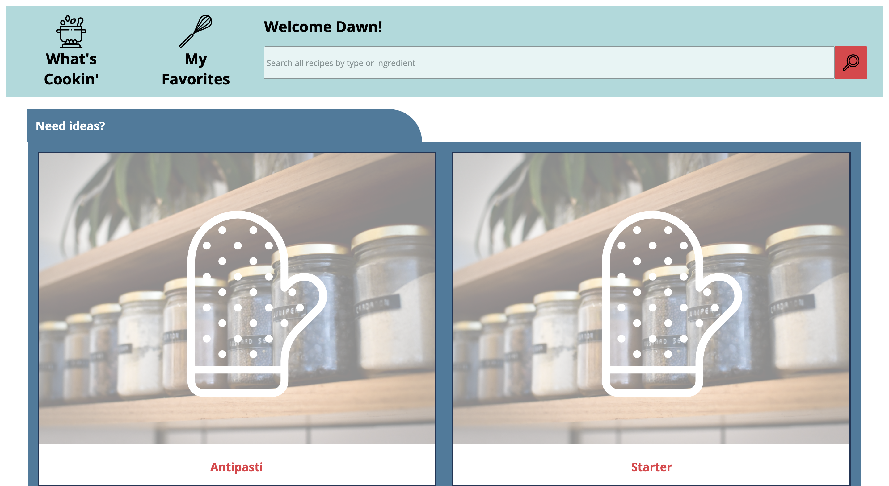
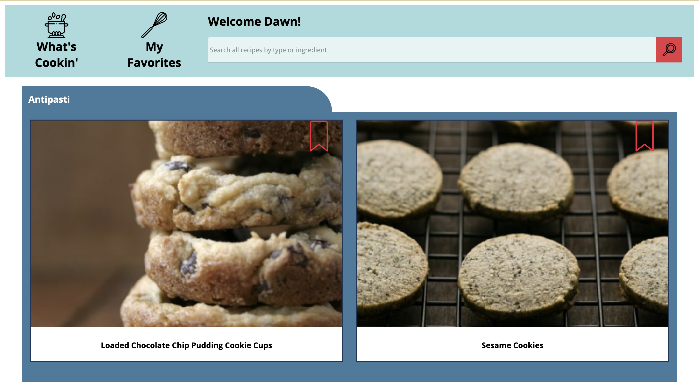

# What's Cookin'? 

In this project we used TDD to create a recipe tracking / meal planning application that allows users to view their favorite recipes and plan shopping trips around them. Users should be able to view a list of recipes, favorite their own recipes, and choose recipes to cook, and make a shopping list based off of these chosen recipes.

The details of this project are outlined in the <a href="https://frontend.turing.io/projects/whats-cookin.html" target="\__blank">project spec</a>.

## Project Manager
[Will Mitchell](https://github.com/wvmitchell)
## Developers
[Bruce Gordon](https://github.com/bruce-gordon)

[Estelle Staffieri](https://github.com/Estaffieri)

## Deployed Site
[What's-Cookin'](https://bruce-gordon.github.io/whats-cookin/)

## Set Up 
In your terminal run:
```open index.html```
This iteration has only been tested in Chrome

## Goals & Objectives
- Follow the specification below to make a working application
- Implement ES6 classes that communicate to each other as needed
- Write modular, reusable code that follows SRP (Single Responsibility Principle)
- Implement a robust testing suite using TDD
- Use object and array prototype methods to perform data manipulation
- Display information on the page while maintaining ability to test class properties and mehtods
- Create a user interface that is easy to use and displays information in a clear way

## Future Iterations
Our user class has a property to store recipesToCook and a method to add recipes to that property.  A future iteration would be to add a button to the app labeled "Recipes To Cook".  This would allow a user to see a list of recipes they want to cook (just like how they can view Favorite Recipes).  We would also add the ability to view the user.pantry, and a method for deducting ingredients from the pantry when a user adds a recipe to user.recipesToCook.

## Functionality Showcase
<p align="center">The home page for What's Cookin'</br>
  
</p><br>

<p align="center">The category view</br>
  
</p><br>

<p align="center">Adding and removing from favorites</br>
  
</p><br>
